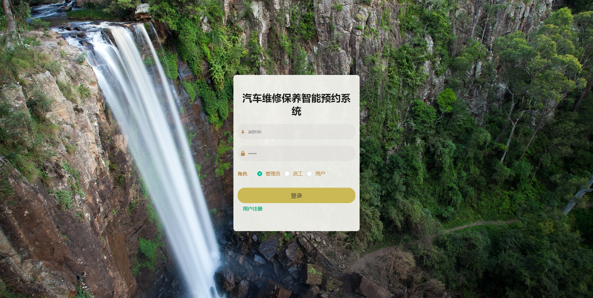
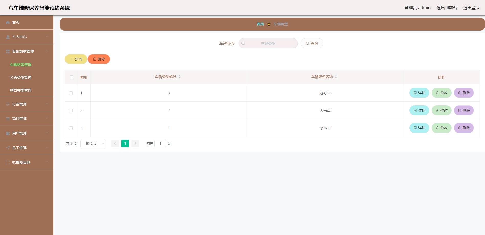
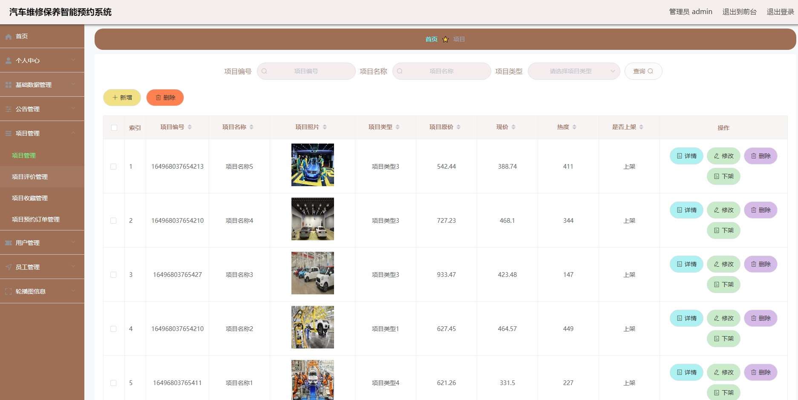
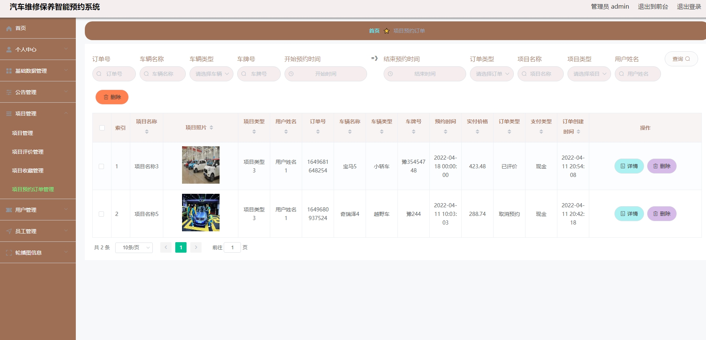
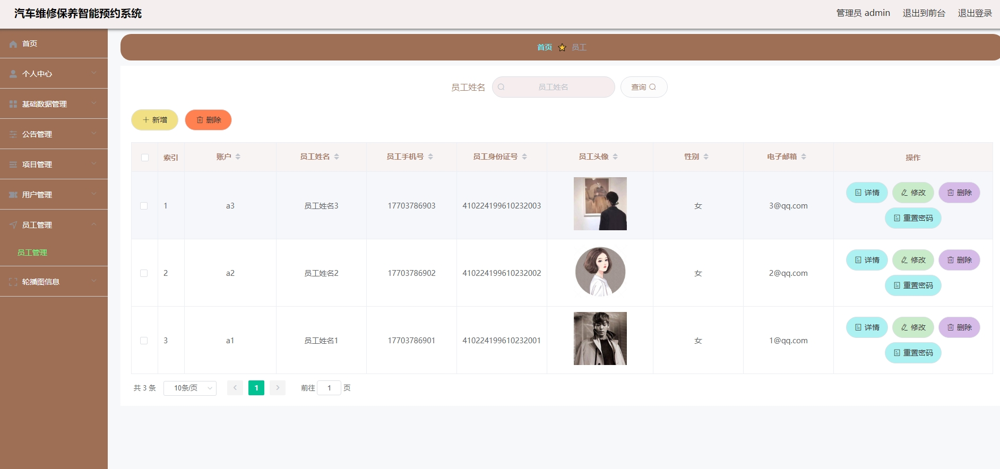
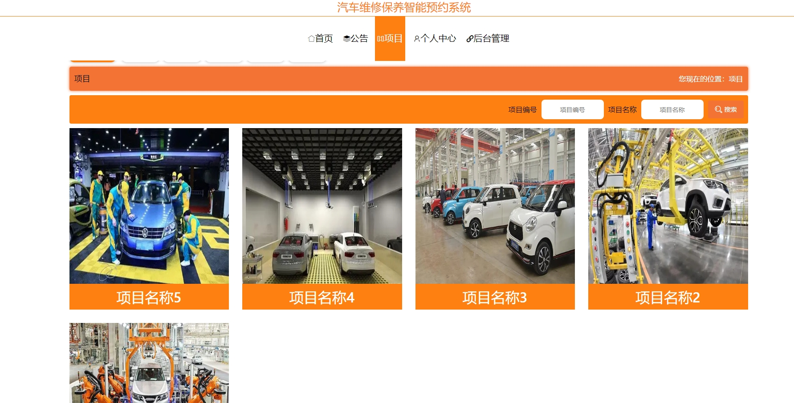
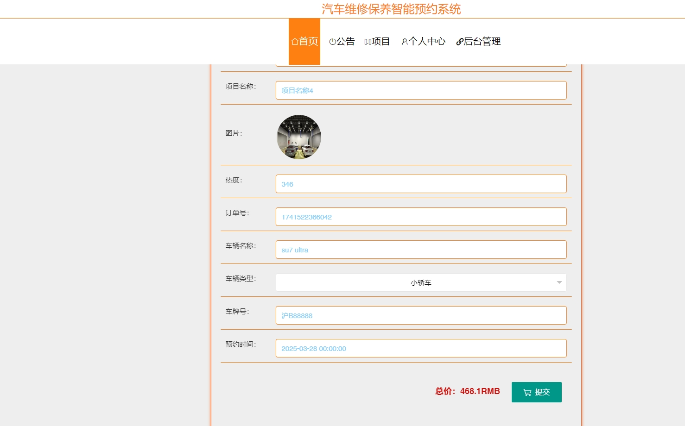
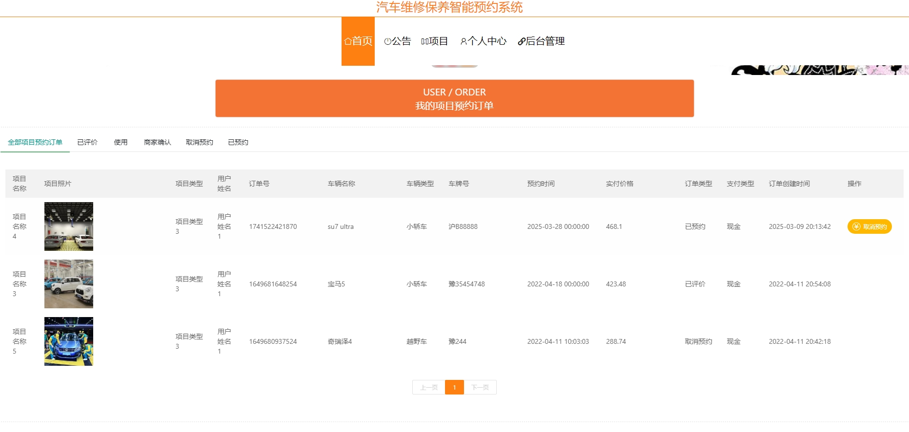
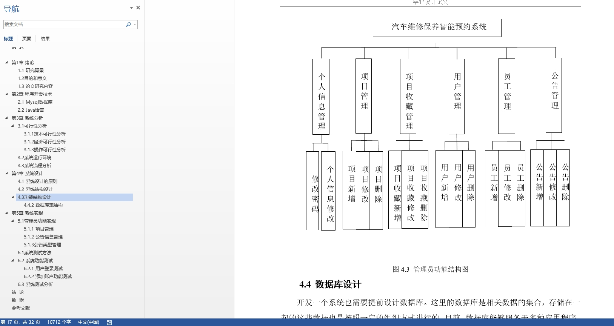

# 1.项目介绍
- 系统角色：管理员、员工、用户
- 功能模块：用户管理、员工管理、汽车类型管理、项目类型管理、维修/预约订单管理、系统管理、公告管理等
- 技术选型：SSM，vue（后端管理web），Layui（门户）等
- 测试环境：idea2024，jdk1.8，mysql5.7，maven3，tomcat8
# 2.项目部署
- 创建数据库，导入sql文件
- idea打开项目，根据本地数据库环境修改 src/main/resources/config.properties  3-5行 （如果你本地数据库是8.0的，注意替换pom里依赖的版本、以及第三行配置serverTimezone，这都是基础，百度遍地都是。）
- 配置tomcat，启动项目，其中，我将deployment下的application contex配置为 /qichebaoyangweixiuyuyuexitong
- http://localhost:8080/qichebaoyangweixiuyuyuexitong/admin/dist/index.html   管理员账号密码：admin/admin， 其他自行查表
- 门户页面：http://localhost:8080/qichebaoyangweixiuyuyuexitong/front/index.html
- 说明：vue项目是src/main/webapp/admin，上面的链接是直接运行了编译后的文件，如果你要对页面做一些修改，可以通过vscode或者webstorm去打开vue项目进行修改
# 3.项目部分截图

# 4.获取方式
[戳我查看](https://gitee.com/aven999/mall)
